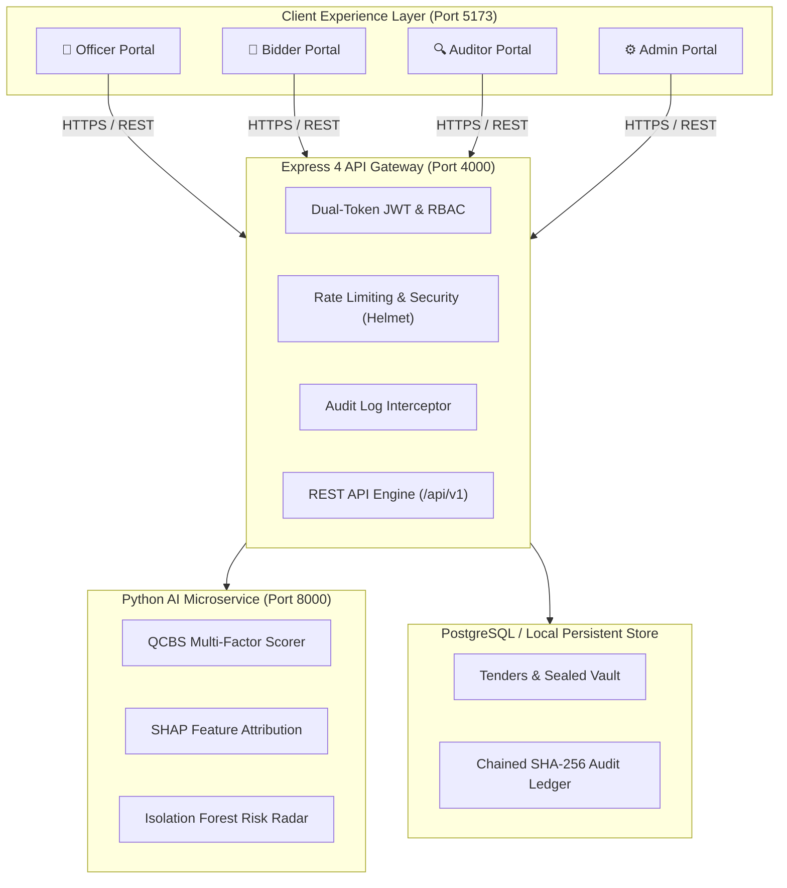
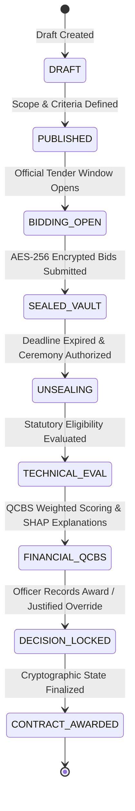

# ProcureAI 🏛️⚡

<div align="center">


### **Intelligent. Fair. Transparent.**
*An Enterprise-Grade, Explainable, and Tamper-Evident e-Procurement Governance Platform*

[](https://github.com/viswanath006/ProcureAI)
[-brightgreen?style=for-the-badge&logo=checkmarx)](https://github.com/viswanath006/ProcureAI)
[](https://github.com/viswanath006/ProcureAI)

[](https://nodejs.org)
[](https://www.typescriptlang.org)
[](https://react.dev)
[](https://vitejs.dev)
[](https://fastapi.tiangolo.com)
[](https://www.postgresql.org)

</div>

---

## 🎯 Core Operating Principle

```
┌─────────────────────────┐         ┌─────────────────────────┐         ┌─────────────────────────┐
│     1. AI RECOMMENDS    │         │     2. HUMANS DECIDE    │         │    3. SYSTEM AUDITS     │
│                         │  ─────► │                         │  ─────► │                         │
│ • QCBS Weighted Scoring │         │ • Statutory Authority   │         │ • SHA-256 Hash Chaining │
│ • Explainable SHAP XAI  │         │ • Mandatory Justification│        │ • Database Immutability │
│ • Anomaly Risk Signals  │         │ • Human Override Record │         │ • Tamper-Evident Ledger │
└─────────────────────────┘         └─────────────────────────┘         └─────────────────────────┘
```

> [!IMPORTANT]
> **Statutory Human Responsibility (GFR 2017 / Rule 149)**:  
> ProcureAI **never** makes autonomous contract awards. Artificial Intelligence serves strictly as an objective, explainable decision-support advisor. All awarding power rests with authenticated public officers, while every approval or override is immutably sealed in a cryptographic audit ledger.

---

## 💡 The Problem & Our Solution

| Traditional Procurement Pitfall | The ProcureAI Solution |
|---|---|
| 💸 **The "Lowest Bidder (L1) Trap"**<br/>Awarding purely on cheapest price causes low quality, delays, and contractor abandonment. | **Quality & Cost Based Selection (QCBS)**<br/>Balanced evaluation (Price 40%, Technical 20%, Experience 15%, Financial 10%, Performance 10%, Risk 5%) for long-term value. |
| 🔓 **Premature Bid Leakage & Insider Leaks**<br/>Unencrypted databases expose commercial quotes before deadlines, killing fair competition. | **AES-256-GCM Sealed Vault**<br/>Client-side encryption locks bids until the official statutory unsealing ceremony. Early decryption is mathematically blocked. |
| 🤝 **Undetected Cartels & Collusion**<br/>Cover bidding and artificial price rings evade traditional manual review. | **Unsupervised Anomaly Radar**<br/>Isolation Forest and proximity clustering detect suspicious bid clustering and predatory dumping automatically. |
| ❓ **The "Black Box" Trust Deficit**<br/>Vendors and watchdogs distrust opaque scoring algorithms without clear reasoning. | **Explainable AI (XAI) via SHAP**<br/>Shapley attributions break down each score into transparent positive and negative factors in plain language. |
| 📝 **Unaccountable Overrides**<br/>Officers overturning recommendations without recorded justification invites suspicion. | **Cryptographic Override Locking**<br/>Mandatory statutory justification prompts require formal reason codes and SHA-256 state locks. |

---

## 🚀 Quick Start

### 1. Local Development (3 Simple Commands)

All services come with ready-to-use local data fallbacks, so you can run the entire stack immediately:

```bash
# 1. Backend (Terminal 1)
cd backend
npm install
npm run dev           # Runs on http://localhost:4000

# 2. AI Service (Terminal 2)
cd ai-service
pip install -r requirements.txt
uvicorn app.main:app --port 8000 --reload   # Runs on http://localhost:8000

# 3. Frontend Web App (Terminal 3)
cd frontend
npm install
npm run dev           # Runs on http://localhost:5173
```

### 2. Docker Compose (One Command)

```bash
cp .env.example .env
docker compose up --build
```

### 🌐 Service Endpoints

| Service | URL | Purpose |
|---|---|---|
| **Frontend Portal** | [http://localhost:5173](http://localhost:5173) | Interactive Web Portal |
| **Backend REST API** | [http://localhost:4000/api/v1](http://localhost:4000/api/v1) | Express API Gateway (`/health`) |
| **AI Evaluation Engine** | [http://localhost:8000](http://localhost:8000) | FastAPI ML Engine (`/docs` for Swagger) |

---

## 👥 Demo Accounts & Portals

ProcureAI provides 4 purpose-built portals with one-click demo login buttons on the [Login Page](http://localhost:5173/login):

> **Universal Demo Password:** `ProcureAI_Dev_2026!`

| Role | Demo Account | Persona | Key Responsibilities |
|---|---|---|---|
| 👔 **Government Officer** | `officer.suresh@finance.gov.in` | Suresh Kumar | Create tenders, unseal bids, run AI scoring, record awards & justified overrides. |
| 🏢 **Bidder Representative** | `bidder.alpha@alphacorp.dev` | Vikram Mehta | Discover tenders, test statutory eligibility gates, submit encrypted sealed proposals. |
| 🔍 **Auditor General** | `auditor.priya@cag.gov.in` | Priya Sharma | Inspect tamper-evident audit ledger, verify cryptographic hash chains, review anomaly logs. |
| ⚙️ **Platform Admin** | `admin.rajesh@procureai.gov.in` | Rajesh Verma | IAM access control, company verification, microservice health and telemetry. |

---

## 🏗️ System Architecture



### 9-Stage Tender Lifecycle State Machine



---

## ✨ Key Platform Features

- 🔐 **AES-256-GCM Sealed Bid Vault**: Proposals are encrypted client-side. The server enforces time-locks preventing premature access before the statutory deadline.
- 📊 **QCBS Multi-Criteria Scoring**: 6 weighted evaluation dimensions:
  - Commercial Price ($40\%$)
  - Technical Capability ($20\%$)
  - Domain Experience ($15\%$)
  - Financial Liquidity ($10\%$)
  - Past Performance ($10\%$)
  - Risk Assessment ($5\%$)
- 🔍 **Explainable AI (SHAP)**: Translates game-theoretic marginal contributions into human-readable positive and negative factors (e.g., *"+12.4 pts: Superior seismic engineering crew"*).
- 🚨 **Isolation Forest Anomaly Radar**: Surfaces statistical outliers and cartel clustering without accusatory bias (framed as *"Risk Indicators Warranting Review"*).
- ⛓️ **Cryptographic Tamper-Evident Ledger**: Every event is chained via chronological SHA-256 hashing. Database triggers prohibit SQL updates or deletions.
- 🎯 **Interactive Demonstration Console**: Built-in 1-click scenarios simulating real-world procurement approval and human override flows.

---

## 🔒 Security & Threat Defense Matrix

ProcureAI was rigorously tested against all 5 critical e-procurement attack vectors:

| Attack Scenario | Threat Description | Architectural Defense | Test Result |
|---|---|---|:---:|
| **1. IDOR Vulnerability** | Bidder attempts to view rival bidder's quote. | Scoped SQL filters (`company_id`) + JWT claims check. | **REJECTED (403)** ✅ |
| **2. Unauthorized Mutation** | Bidder attempts to alter a bid post-submission. | Strict single-submission check + immutable records. | **REJECTED (403)** ✅ |
| **3. Premature Bid Leakage** | Officer attempts to preview quotes before deadline. | Server clock-lock (`now < deadline`) + ciphertext masking. | **REJECTED (400)** ✅ |
| **4. Privilege Escalation** | Unauthorized user attempts to award tender. | Server-side RBAC middleware (`GOVT_OFFICER`, `ADMIN`). | **REJECTED (403)** ✅ |
| **5. Decision Tampering** | Changing a finalized award decision. | Database flag `is_locked = true` + SQL rejection triggers. | **REJECTED (400)** ✅ |

---

## 🧪 Automated Testing & Verification

The platform includes **11 automated verification test suites** with 100% pass rate:

```bash
cd backend
npm run test:auth          # Dual-Token Auth & 4-Role RBAC
npm run test:tender        # 9-Stage Tender Lifecycle
npm run test:eligibility   # 6-Gate Statutory Eligibility Engine
npm run test:sealed-bids   # AES-256-GCM Cryptographic Vault
npm run test:ai-eval       # QCBS Vector Scoring Engine
npm run test:xai           # SHAP Feature Attribution
npm run test:anomaly       # Isolation Forest Collusion Radar
npm run test:decision      # Decision Lock & Mandatory Override
npm run test:audit         # SHA-256 Audit Ledger & Chain Verifier
npm run test:security      # 5-Vector Penetration Test Suite
npm run demo               # 17-Step End-to-End Procurement Simulation
```

```
=============================================================================
             PROCUREAI SYSTEM VERIFICATION REPORT (389 / 389 PASSED)
=============================================================================
  ✅ Phase 3  Authentication & RBAC:           30 / 30 Passed
  ✅ Phase 4  Tender Lifecycle State Machine:  30 / 30 Passed
  ✅ Phase 5  Eligibility Engine (6 Gates):    27 / 27 Passed
  ✅ Phase 6  Sealed-Bid Cryptography:         32 / 32 Passed
  ✅ Phase 7  AI Evaluation Engine (QCBS):     46 / 46 Passed
  ✅ Phase 8  Explainable AI (SHAP XAI):       35 / 35 Passed
  ✅ Phase 9  Anomaly & Collusion Detection:   38 / 38 Passed
  ✅ Phase 10 Human Decision Lock Engine:      28 / 28 Passed
  ✅ Phase 11 Tamper-Evident Audit Ledger:     69 / 69 Passed
  ✅ Phase 13 Security & Penetration Suite:    31 / 31 Passed
  ✅ Phase 14 E2E Demo Verification:           Passed (Scenarios 1 & 2)
  ✅ AI Service Pytest Engine Suite:           23 / 23 Passed
=============================================================================
  TOTAL: 389 / 389 PASSED (100% REGRESSION CONFIRMATION)
=============================================================================
```

---

## 📡 API & Documentation

ProcureAI provides an enterprise REST API Gateway secured by dual-token JWT authentication, Helmet security policies, and strict Role-Based Access Control (RBAC).

- 📖 **Interactive Swagger UI**: Launch the AI microservice and navigate to [http://localhost:8000/docs](http://localhost:8000/docs).
- 📑 **Internal API Specifications**: See [docs/api.md](docs/api.md) for detailed route contracts, payload schemas, and access roles.

---

## ⚖️ Statutory Governance & Compliance

ProcureAI conforms strictly to Indian public procurement standards:
- **GFR 2017 (Rule 149 / 192)**: Quality and Cost Based Selection (QCBS) prioritized over lowest-bidder traps.
- **CVC Directives**: Enforces sealed confidentiality, comparative parity, and mandatory written justification for any technical override.
- **IT Act (2000) & DPDP Act (2023)**: Client-side AES-256 encryption, strict tenant isolation, and tamper-evident audit logs.

---

## 📄 License & Team

- **Hackathon Track**: Smart India Hackathon (SIH) 2026
- **Repository**: [https://github.com/viswanath006/ProcureAI](https://github.com/viswanath006/ProcureAI)
- **License**: MIT

<div align="center">
<sub>Built with integrity for fair, transparent, and accountable governance.</sub>
</div>
