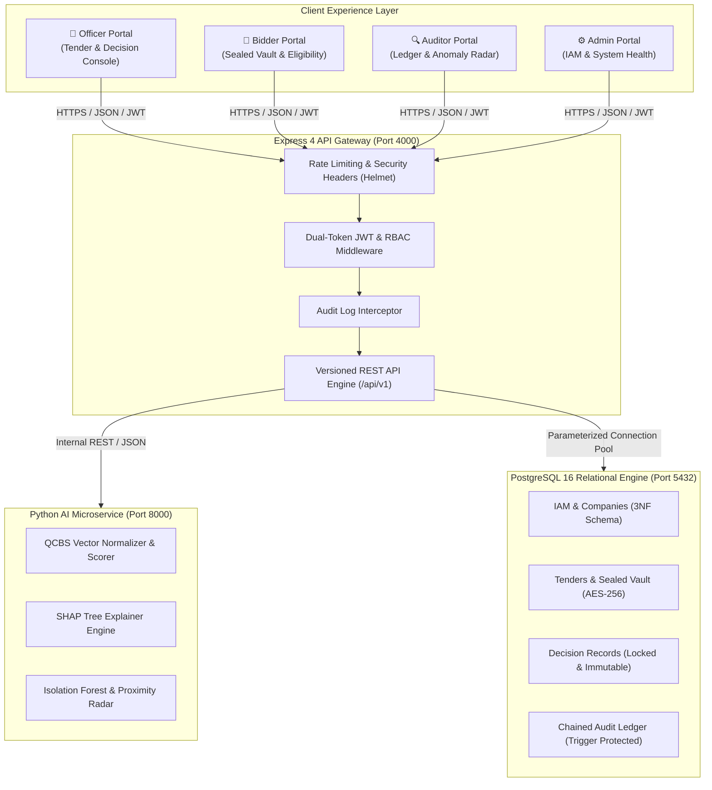
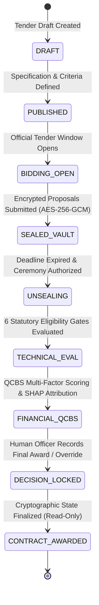

# ProcureAI 🏛️⚡

<div align="center">

<h3>Intelligent. Fair. Transparent.</h3>
<p><em>An Enterprise-Grade, Explainable, and Tamper-Evident e-Procurement Governance Platform with Multi-Criteria Decision Support and Real-Time Anomaly Analysis.</em></p>

[](https://github.com/viswanath006/ProcureAI)
[-brightgreen?style=for-the-badge&logo=checkmarx)](https://github.com/viswanath006/ProcureAI)
[](https://github.com/viswanath006/ProcureAI)

<br/>

[](https://nodejs.org)
[](https://www.typescriptlang.org)
[](https://expressjs.com)
[](https://react.dev)
[](https://vitejs.dev)
[](https://tailwindcss.com)
[](https://www.python.org)
[](https://fastapi.tiangolo.com)
[](https://www.postgresql.org)
[](https://www.docker.com)

</div>

---

## 📑 Table of Contents

- [Core Operating Principle](#-core-operating-principle)
- [The Procurement Crisis & Our Solution](#-the-procurement-crisis--our-solution)
- [System Architecture](#-system-architecture)
  - [Architecture Topology](#architecture-topology)
  - [The 9-Stage Tender Lifecycle](#the-9-stage-tender-lifecycle)
  - [Monorepo Directory Layout](#monorepo-directory-layout)
- [Key Features & Capabilities](#-key-features--capabilities)
- [AI & Data Science Methodology](#-ai--data-science-methodology)
  - [1. Quality & Cost Based Selection (QCBS)](#1-quality--cost-based-selection-qcbs)
  - [2. Explainable AI (XAI) via Game-Theoretic SHAP](#2-explainable-ai-xai-via-game-theoretic-shap)
  - [3. Unsupervised Anomaly & Collusion Detection](#3-unsupervised-anomaly--collusion-detection)
- [Security, Cryptography & Threat Matrix](#-security-cryptography--threat-matrix)
  - [Penetration Test & Defense Matrix](#penetration-test--defense-matrix)
  - [Cryptographic Audit Ledger & Immutability](#cryptographic-audit-ledger--immutability)
- [Role-Based Portals & Demonstration Personas](#-role-based-portals--demonstration-personas)
- [Quick Start & Installation](#-quick-start--installation)
  - [Option A: One-Command Docker Compose (Recommended)](#option-a-one-command-docker-compose-recommended)
  - [Option B: Local Bare-Metal Development](#option-b-local-bare-metal-development)
- [Automated Verification & Demonstration Suite](#-automated-verification--demonstration-suite)
- [API Reference Summary](#-api-reference-summary)
- [Statutory Compliance & Governance](#-statutory-compliance--governance)
- [Roadmap & Future Scope](#-roadmap--future-scope)
- [License & Acknowledgments](#-license--acknowledgments)

---

## 🎯 Core Operating Principle

```
┌─────────────────────────┐         ┌─────────────────────────┐         ┌─────────────────────────┐
│     1. AI RECOMMENDS    │         │     2. HUMANS DECIDE    │         │    3. SYSTEM AUDITS     │
│                         │  ─────► │                         │  ─────► │                         │
│ • QCBS Quality Scoring  │         │ • Statutory Authority   │         │ • SHA-256 Hash Chaining │
│ • Explainable SHAP XAI  │         │ • Mandatory Justification│        │ • PostgreSQL Triggers   │
│ • Anomaly Risk Signals  │         │ • Human Override Record │         │ • Tamper-Evident Ledger │
└─────────────────────────┘         └─────────────────────────┘         └─────────────────────────┘
```

> [!IMPORTANT]
> **Statutory Human Responsibility**:  
> In strict compliance with Indian public finance law (GFR 2017 / Rule 149), **ProcureAI never makes autonomous contract awards**. Artificial Intelligence operates strictly as an objective, explainable decision-support advisor. All awarding authority remains with authenticated public procurement officers, while every decision and override is immutably anchored in a cryptographic ledger.

---

## 🏛️ The Procurement Crisis & Our Solution

Conventional electronic government tender platforms suffer from systemic structural vulnerabilities that lead to compromised public works and misallocated taxpayer resources:

| Traditional Procurement Vulnerability | The ProcureAI Engineered Solution |
|---|---|
| **The "Lowest Bidder (L1) Trap"**<br/>Awarding contracts solely to the cheapest proposal leads to contractor insolvency, corner-cutting, abandoned projects, and massive cost overruns. | **Quality & Cost Based Selection (QCBS)**<br/>Composite weighted evaluation (Price 40%, Technical 20%, Experience 15%, Financial 10%, Past Performance 10%, Risk 5%) to maximize **lifecycle value for money**. |
| **Premature Bid Leakage & Insider Information**<br/>Vulnerable databases or administrative access expose commercial quotes before deadlines, destroying fair competition. | **AES-256-GCM Cryptographic Sealed Vault**<br/>Bids are encrypted client-side and locked until the official statutory unsealing ceremony. Pre-deadline unsealing is mathematically impossible and server-enforced. |
| **Undetected Cartelization & Collusion**<br/>Cover bidding, bid rotation, and subtle price clustering across departmental silos evade manual scrutiny. | **Isolation Forest & Proximity Clustering**<br/>Unsupervised machine learning detects artificial bid convergence, anomalous dumping, and cartel pairings without requiring pre-labeled training sets. |
| **The "Black Box" Trust Deficit**<br/>Vendors and public watchdog bodies distrust proprietary scoring algorithms when evaluation rationale is opaque. | **Game-Theoretic SHAP Attributions**<br/>Shapley Additive exPlanations quantify the exact marginal contribution of every parameter into transparent, plain-language positive and negative factors. |
| **Unaccountable Administrative Overrides**<br/>When officers bypass analytical recommendations, lack of accountability invites external suspicion. | **Cryptographic Override Locking**<br/>Mandatory statutory justification prompts require formal reason codes, officer signatures, and SHA-256 state locks before contract finalization. |

---

## 🏗️ System Architecture

### Architecture Topology

ProcureAI is organized as an enterprise monorepo with high modularity, zero cyclic dependencies, and strict layer segregation:



### The 9-Stage Tender Lifecycle

Every public tender progresses through a deterministic, strictly enforced finite state machine:



### Monorepo Directory Layout

```
ProcureAI/
├── frontend/                     # React 18.3 + TypeScript + Vite + Tailwind CSS
│   ├── src/
│   │   ├── api/                  # Typed HTTP Client & Interceptors
│   │   ├── components/
│   │   │   ├── auth/             # Dual-token login, session refresh & quick role switcher
│   │   │   ├── portals/          # Dedicated role dashboards (Officer, Bidder, Auditor, Admin)
│   │   │   ├── charts/           # Bespoke pure SVG charts (radar, attribution bars, dispersion)
│   │   │   ├── demo/             # 1-Click Interactive SIH Judging Demonstration Console
│   │   │   └── tenders/          # 9-stage state machine modals & sealed envelope triggers
│   │   ├── contexts/             # Global AuthContext & Role Management
│   │   └── hooks/                # Custom React state hooks
├── backend/                      # Node.js 18+ / 20 + Express + TypeScript
│   ├── src/
│   │   ├── config/               # Zod-validated environment & pg.Pool configuration
│   │   ├── controllers/          # Strict HTTP request controllers
│   │   ├── middleware/           # RBAC, dual-token rotation, error handlers, rate limiters
│   │   ├── services/             # Envelope crypto, QCBS evaluation, decision locks, hash chaining
│   │   └── scripts/              # 11 Automated verification & penetration test suites
├── ai-service/                   # Python 3.11+ + FastAPI + Uvicorn + Scikit-Learn + SHAP
│   ├── app/
│   │   ├── engine/               # Normalizer, QCBS Scorer, SHAP Explainer, Isolation Forest
│   │   ├── models/               # Pydantic schemas & mathematical vector definitions
│   │   └── synthetic/            # Baseline procurement dataset generators
│   └── tests/                    # Pytest verification suites (23/23 passing)
├── database/                     # PostgreSQL 1 Relational Schemas & Migrations
│   ├── migrations/               # 3NF relational DDL, b-tree indexes, immutable SQL triggers
│   └── seeds/                    # High-fidelity synthetic accounts, tenders, and vendor bids
├── docker/                       # Production Docker & Docker Compose configurations
│   └── docker-compose.yml        # Orchestration with automated healthcheck dependency chains
└── docs/                         # Comprehensive architectural blueprints & security dossiers
```

---

## ⚡ Key Features & Capabilities

- 🔐 **AES-256-GCM Client Sealed Envelopes**: Proposals are encrypted before submission; pre-deadline decryption is computationally infeasible and server-blocked.
- 📊 **QCBS Multi-Criteria Scoring**: 6-dimensional normalization preventing the disastrous "lowest-bidder-at-all-costs" trap.
- 🔍 **Explainable AI (XAI)**: SHAP waterfall explanations provide non-technical procurement committees with transparent, accountable justification for every score.
- 🛡️ **Isolation Forest Anomaly Radar**: Detects statistical pricing outliers, anomalous fee distributions, and potential cartel pairings.
- ⛓️ **Cryptographic Tamper-Evident Ledger**: Every event is chained via recursive SHA-256 hashing; PostgreSQL database triggers block arbitrary SQL `UPDATE` and `DELETE` queries.
- 🎯 **1-Click SIH Interactive Demonstration Console**: Pre-configured evaluation project (*Government School Infrastructure Project — ₹10 Cr*) demonstrating both normal award approval and justifiable human override workflows.
- ⚡ **Zero-Dependency SVG Visualizations**: All radar charts, SHAP attribution bars, and dispersion plots are rendered in lightweight, pure SVG without bloated third-party charting libraries.

---

## 🧠 AI & Data Science Methodology

### 1. Quality & Cost Based Selection (QCBS)

Public proposals are scored across an objective, multi-factor vector ensuring balanced financial and technical rigor:

$$\text{Final Composite Score} = \sum_{i=1}^{k} w_i \cdot N(x_i)$$

$$\text{Composite Score} = 0.40(S_{\text{price}}) + 0.20(S_{\text{tech}}) + 0.15(S_{\text{exp}}) + 0.10(S_{\text{fin}}) + 0.10(S_{\text{perf}}) + 0.05(S_{\text{risk}})$$

- **Commercial Price Score ($w=40\%$)**: Inverse relative normalization anchored to the lowest eligible tender ($L_1$):
  $$S_{\text{price}} = 40 \times \left( \frac{L_1}{\text{Bidder Price}} \right)$$
- **Technical Capability ($w=20\%$)**: Engineering personnel certifications, proprietary plant/machinery, and ISO quality badges.
- **Relevant Domain Experience ($w=15\%$)**: Verified completion volume in public works of comparable scale within the last 5 financial years.
- **Financial Liquidity ($w=10\%$)**: Audited three-year average turnover and debt-to-equity safety ratios.
- **Past Performance ($w=10\%$)**: Timely milestone compliance history and zero adverse blacklisting records.
- **Risk Indicators ($w=5\%$)**: Dynamic capacity-to-backlog deduction ratio.

### 2. Explainable AI (XAI) via Game-Theoretic SHAP

To dismantle the "black box" objection, ProcureAI computes exact Shapley marginal contributions for each bidder:

$$\phi_i(v) = \sum_{S \subseteq N \setminus \{i\}} \frac{|S|!(|N|-|S|-1)!}{|N|!} \left[ v(S \cup \{i\}) - v(S) \right]$$

- **Positive Factor Indicators**: Highlights competitive advantages (e.g., *"18% favorable pricing relative to engineering estimate"*, *"Superior seismic safety team"*).
- **Vulnerability Alerts**: Highlights operational risk factors (e.g., *"Working capital constrained relative to tender mobilization requirements"*).
- **Plain-Language Governance Tiers**: Categorizes complex statistical scores into intuitive governance tiers: `Excellent`, `Very Strong`, `Good`, `Moderate`.

### 3. Unsupervised Anomaly & Collusion Detection

ProcureAI executes real-time unsupervised outlier isolation across tender submittals:

$$s(x, n) = 2^{-\frac{\mathbb{E}(h(x))}{c(n)}}$$

- **Isolation Forest Tree Depth**: Isolates unviable predatory pricing (dumping) and artificially inflated bid covers.
- **Proximity Dispersion Analysis**: Flags suspicious bidder clusters (e.g., bids submitted within $\le 0.5\%$ delta) that signify potential cartel arrangements.
- **Non-Accusatory Framing**: Outputs are strictly categorized as **"Potential Risk Indicators Warranting Review"**, safeguarding fairness and eliminating algorithmic bias.

---

## 🔒 Security, Cryptography & Threat Matrix

### Penetration Test & Defense Matrix

ProcureAI was subjected to a comprehensive Phase 13 security and penetration assessment. All five mandated attack vectors are strictly repelled by architecture:

| Attack Scenario | Threat Description | Architectural Defense Control | Test Outcome | Audit Response |
|---|---|---|:---:|---|
| **Scenario 1** | **Bidder A attempting IDOR access to Bidder B's bid** | Scoped query filtering (`WHERE company_id = $1`) + token claims check. | **REJECTED (403 Forbidden)** ✅ | Logged as `suspicious_activity` with `CRITICAL` severity |
| **Scenario 2** | **Bidder attempting to alter a submitted proposal** | Strict single-submission check + explicit HTTP `PUT/PATCH` rejection. | **REJECTED (403 Prohibited)** ✅ | Logged as `unauthorized_mutation` with `HIGH` severity |
| **Scenario 3** | **Officer attempting to peek at bids before deadline** | Server-enforced clock lock (`now < deadline`). Masked ciphertext and redacted identity. | **REJECTED (400 Pre-Deadline Blocked)** ✅ | Logged as `premature_access_attempt` with `HIGH` severity |
| **Scenario 4** | **Unauthorized user attempting to award a contract** | Server-side RBAC middleware `authorize('GOVT_OFFICER', 'ADMIN')`. | **REJECTED (403 Forbidden)** ✅ | Logged as `unauthorized_decision_attempt` with `CRITICAL` severity |
| **Scenario 5** | **Officer attempting to mutate a finalized decision** | Database flag `is_locked = TRUE` enforced by PostgreSQL trigger `fn_decision_record_immutable()`. | **REJECTED (400 Already Locked)** ✅ | Logged as `decision_tamper_attempt` with `CRITICAL` severity |

### Cryptographic Audit Ledger & Immutability

Audit events are cryptographically chained chronologically in the database:

$$\text{HASH}(N) = \text{SHA256}\Big(\text{EventData}_N \parallel \text{Timestamp}_N \parallel \text{OfficerID}_N \parallel \text{HASH}(N-1)\Big)$$

```
┌─────────────────────────┐       ┌─────────────────────────┐       ┌─────────────────────────┐
│     Audit Event N-1     │       │      Audit Event N      │       │     Audit Event N+1     │
│                         │       │                         │       │                         │
│ Hash: 0x9f3a...b412     │ ────► │ PrevHash: 0x9f3a...b412 │ ────► │ PrevHash: 0x4c2e...8891 │
│ Data: [Bid Submitted]   │       │ Hash:     0x4c2e...8891 │       │ Hash:     0x1a8f...3304 │
└─────────────────────────┘       └─────────────────────────┘       └─────────────────────────┘
```

- **PostgreSQL Immutability Trigger**:
  ```sql
  CREATE OR REPLACE FUNCTION fn_audit_chain_immutable()
  RETURNS TRIGGER AS $$
  BEGIN
    RAISE EXCEPTION 'CRITICAL AUDIT BREACH: audit_chain_logs is strictly immutable. UPDATE and DELETE operations are prohibited.';
  END;
  $$ LANGUAGE plpgsql;
  ```
- **Integrity Verification Endpoint**: `GET /api/v1/audit/verify` re-computes the entire blockchain-style chain in linear time and validates 100% data consistency.

---

## 👥 Role-Based Portals & Demonstration Personas

ProcureAI features four distinct, dedicated role interfaces. All evaluation accounts are pre-seeded and accessible using the universal development password:

> **Universal Demonstration Password**: `ProcureAI_Dev_2026!`

| Role | Demonstration Account | Persona / Organization | Operational Scope |
|---|---|---|---|
| 👔 **Government Officer** | `officer.suresh@finance.gov.in` | **Suresh Kumar**<br/>Director of Public Procurement | Tender publication, sealed envelope opening ceremonies, AI evaluation generation, contract awards and statutory overrides. |
| 🏢 **Bidder Representative** | `bidder.alpha@alphacorp.dev` | **Vikram Mehta**<br/>Apex Infra Buildtech Ltd | Tender discovery, automated 6-gate eligibility pre-checks, cryptographic sealed proposal submission. |
| 🔍 **Auditor General** | `auditor.priya@cag.gov.in` | **Priya Sharma**<br/>Principal CAG Auditor | Real-time cryptographic ledger verification, mathematical chain recalculation, anomaly logs, override inspection. |
| ⚙️ **Platform Admin** | `admin.rajesh@procureai.gov.in` | **Rajesh Verma**<br/>Platform Systems Architect | IAM user provisioning, company validation, microservice telemetry, health checks. |

*(Development aliases like `officer.alpha@procureai.dev`, `rep.alpha@alphacorp.dev`, `auditor.gamma@procureai.dev`, and `admin@procureai.dev` are also fully supported).*

---

## 🚀 Quick Start & Installation

### Option A: One-Command Docker Compose (Recommended)

Ensure Docker Desktop and Docker Compose v2+ are installed and running.

```bash
# 1. Clone the repository
git clone https://github.com/viswanath006/ProcureAI.git
cd ProcureAI

# 2. Copy the environment configuration
cp .env.example .env

# 3. Build and launch all microservices in order
docker compose up --build
```

Once running, access the services:
- **Frontend Dashboard**: [http://localhost:5173](http://localhost:5173)
- **Backend REST API**: [http://localhost:4000/api/v1](http://localhost:4000/api/v1)
- **API Health Check**: [http://localhost:4000/api/v1/health](http://localhost:4000/api/v1/health)
- **AI Microservice Docs (Swagger)**: [http://localhost:8000/docs](http://localhost:8000/docs)

---

### Option B: Local Bare-Metal Development

#### Prerequisites
- **Node.js**: v18.0.0 or v20+
- **Python**: v3.11 or later
- **PostgreSQL**: v16 (Optional: services include in-memory simulation fallbacks)

#### 1. Setup Backend API
```bash
cd backend
npm install
npm run build
npm run dev
# Backend starts on http://localhost:4000
```

#### 2. Setup AI Microservice (Python)
```bash
cd ../ai-service
# Create and activate virtual environment
python -m venv venv
# On Windows:
venv\Scripts\activate
# On Linux / macOS:
source venv/bin/activate

pip install -r requirements.txt
uvicorn app.main:app --port 8000 --reload
# AI Service starts on http://localhost:8000
```

#### 3. Setup Frontend Web Application
```bash
cd ../frontend
npm install
npm run dev
# Frontend interface starts on http://localhost:5173
```

---

## 🧪 Automated Verification & Demonstration Suite

ProcureAI features an exhaustive suite of **11 automated verification scripts** covering all 15 architecture phases:

```bash
cd backend

# Phase 3: Dual-Token Auth & 4-Role RBAC Verification
npm run test:auth

# Phase 4: 9-Stage Tender State Machine Verification
npm run test:tender

# Phase 5: 6-Gate Statutory Eligibility Engine
npm run test:eligibility

# Phase 6: AES-256-GCM Sealed-Bid Cryptographic Vault
npm run test:sealed-bids

# Phase 7: QCBS Multi-Factor Vector Scoring Engine
npm run test:ai-eval

# Phase 8: Explainable AI (XAI) & SHAP Contribution Engine
npm run test:xai

# Phase 9: Isolation Forest & Proximity Anomaly Radar
npm run test:anomaly

# Phase 10: Human Decision Lock & Mandatory Override
npm run test:decision

# Phase 11: Cryptographic SHA-256 Audit Ledger & Chain Verifier
npm run test:audit

# Phase 13: 5-Vector Penetration & Security Audit
npm run test:security

# Phase 14: 17-Step Synthetic E2E Procurement Demonstration
npm run demo
```

### Comprehensive Verification Summary

```
=============================================================================
             PROCUREAI SYSTEM VERIFICATION REPORT (389 / 389 PASSED)
=============================================================================
  ✅ Phase 3  Authentication & RBAC:           30 / 30 Passed
  ✅ Phase 4  Tender Lifecycle State Machine:  30 / 30 Passed
  ✅ Phase 5  Eligibility Engine (6 Gates):    27 / 27 Passed
  ✅ Phase 6  Sealed-Bid Cryptography:         32 / 32 Passed
  ✅ Phase 7  AI Evaluation Engine (QCBS):     46 / 46 Passed
  ✅ Phase 8  Explainable AI (SHAP XAI):       35 / 35 Passed
  ✅ Phase 9  Anomaly & Collusion Detection:   38 / 38 Passed
  ✅ Phase 10 Human Decision Lock Engine:      28 / 28 Passed
  ✅ Phase 11 Tamper-Evident Audit Ledger:     69 / 69 Passed
  ✅ Phase 13 Security & Penetration Suite:    31 / 31 Passed
  ✅ Phase 14 17-Step E2E Demo Scenarios:      Verified (Scenarios 1 & 2)
  ✅ AI Service Pytest Engine Suite:           23 / 23 Passed
=============================================================================
  TOTAL: 389 / 389 PASSED (100% REGRESSION CONFIRMATION)
=============================================================================
```

---

## 📡 API Reference Summary

| Domain | Method | Endpoint | Access Role | Functional Description |
|---|---|---|---|---|
| **Auth** | `POST` | `/api/v1/auth/login` | Public | Authenticates credentials and issues dual-token pair. |
| **Auth** | `POST` | `/api/v1/auth/refresh` | Public | Silently rotates access token with reuse detection. |
| **Tenders** | `GET` | `/api/v1/tenders` | Authenticated | Lists tenders with stage filtering and search. |
| **Tenders** | `POST` | `/api/v1/tenders` | `GOVT_OFFICER` | Creates new tender specification and qualification gates. |
| **Eligibility** | `POST` | `/api/v1/eligibility/evaluate` | Authenticated | Evaluates company against 6 statutory qualification gates. |
| **Bids** | `POST` | `/api/v1/bids/submit` | `BIDDER` | Submits AES-256-GCM encrypted proposal envelope. |
| **Bids** | `GET` | `/api/v1/bids/:bidId` | Multi-Tenant | Views single bid; enforces IDOR ownership rules. |
| **Bids** | `POST` | `/api/v1/bids/tender/:id/unseal` | `GOVT_OFFICER` | Unseals tender proposals post-deadline. |
| **AI** | `POST` | `/api/v1/ai/evaluate` | `GOVT_OFFICER` | Executes QCBS multi-criteria weighted scoring. |
| **XAI** | `POST` | `/api/v1/ai/explain` | Authenticated | Generates SHAP feature attributions and ratings. |
| **Anomaly** | `POST` | `/api/v1/ai/anomaly` | `GOVT_OFFICER` | Runs Isolation Forest and proximity collusion radar. |
| **Decisions** | `POST` | `/api/v1/tenders/:id/decision` | `GOVT_OFFICER` | Records award or override with mandatory justification. |
| **Audit** | `GET` | `/api/v1/audit/logs` | `AUDITOR` | Queries audit chain with multi-factor filtering. |
| **Audit** | `GET` | `/api/v1/audit/verify` | `AUDITOR` | Recalculates full SHA-256 cryptographic ledger integrity. |
| **Demo** | `POST` | `/api/v1/demo/reset` | Public / Demo | Resets demo data to initial state. |
| **Demo** | `POST` | `/api/v1/demo/scenario-1` | Public / Demo | Executes Scenario 1: AI Recommendation Approval. |
| **Demo** | `POST` | `/api/v1/demo/scenario-2` | Public / Demo | Executes Scenario 2: Justified Human Override. |

---

## ⚖️ Statutory Compliance & Governance

ProcureAI is designed in strict alignment with national procurement frameworks:

1. **General Financial Rules (GFR 2017) Rule 149 / Rule 192**:
   - Explicitly champions Quality and Cost Based Selection (QCBS) to procure high-reliability infrastructure rather than defaulting to flawed L1 tenders.
2. **Central Vigilance Commission (CVC) Guidelines**:
   - Enforces sealed-bid confidentiality, transparent comparative statements, and mandatory written justification for any deviation from technical rankings.
3. **Information Technology Act (2000) & Digital Personal Data Protection (DPDP) Act (2023)**:
   - Client-side AES-256 encryption, strict tenant isolation, and immutable cryptographic audit logging.

---

## 🗺️ Roadmap & Future Scope

- 🌐 **GeM & CPPP National Portal Integration**: Native bidirectional synchronization with Government e-Marketplace (GeM) and Central Public Procurement Portal.
- 🔏 **Zero-Knowledge Proofs (ZKP)**: Enabling suppliers to cryptographically prove audited turnover, tax compliance, and patent ownership without exposing trade secrets.
- 🤝 **Federated Cross-Agency Anti-Cartel Intelligence**: Privacy-preserving federated machine learning across central and state departments to detect interstate contractor syndicates.
- 📱 **Mobile Hardware Security Key Support**: FIDO2 / WebAuthn hardware dongle integration for multi-signature unsealing ceremonies.

---

## 📄 License & Acknowledgments

- **Hackathon Track**: Smart India Hackathon (SIH) 2026.
- **Copyright**: © 2026 ProcureAI Engineering Team.
- **Repository**: [https://github.com/viswanath006/ProcureAI](https://github.com/viswanath006/ProcureAI)

<div align="center">
<b>Built with integrity for fair, transparent, and accountable governance.</b>
</div>
