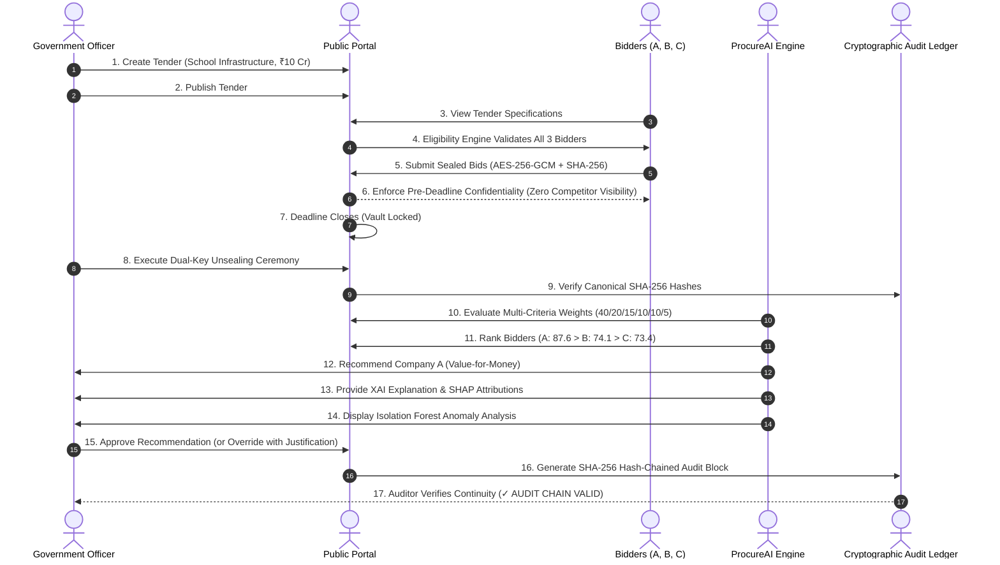

# ProcureAI — End-to-End Procurement Demonstration Guide (Phase 14)

**Document Version**: 1.0.0  
**Classification**: Government SIH Demonstration Dossier  
**Platform**: ProcureAI  
**Tagline**: "Intelligent. Fair. Transparent."  

---

## Executive Summary

Phase 14 delivers a complete, realistic synthetic demonstration of the ProcureAI procurement ecosystem.

The demonstration resolves a classic public procurement challenge: **Avoiding the "Lowest Bidder (L1) Trap"**. 

Under Indian General Financial Rules (GFR Rule 149 / Quality and Cost Based Selection — QCBS), procuring entities must maximize **value for money**, taking into account quality, past reliability, technical capacity, and lifecycle costs, rather than blindly selecting the lowest tender.

---

## 1. Demonstration Scenario Profile

### The Tender
- **Project**: **Government School Infrastructure Project**
- **Reference**: `PROC-2026-EDU-SCH-01`
- **Department**: Department of School Education & Literacy, Govt. of India
- **Estimated Budget**: **₹10 Crore** (₹10,00,00,000 / 1,000,000,000 Paisa)
- **Scope**: Construction of modern STEM laboratories, digital smart classrooms, seismic-reinforced foundations, and sanitation blocks across 25 rural secondary schools.

### The 3 Competing Synthetic Companies

| Factor | Company A (*Apex Infra Buildtech*) | Company B (*Bharat Civil Works*) | Company C (*Crescent Urban Developers*) |
|---|:---:|:---:|:---:|
| **Commercial Bid** | **₹8.20 Crore** | **₹7.80 Crore (LOWEST / L1)** | **₹8.50 Crore** |
| **Price Score (40%)** | 38.0 / 40 | **40.0 / 40 (Max)** | 36.7 / 40 |
| **Technical Capability (20%)** | **18.8 / 20** | 12.5 / 20 | 15.0 / 20 |
| **Relevant Experience (15%)** | **14.2 / 15** | 9.8 / 15 | 11.5 / 15 |
| **Financial Capacity (10%)** | **8.8 / 10** | 7.2 / 10 | 8.0 / 10 |
| **Past Performance (10%)** | **9.2 / 10** | 6.8 / 10 | 7.5 / 10 |
| **Risk Indicators (5%)** | **4.2 / 5** | 3.8 / 5 | 4.0 / 5 |
| **FINAL COMPOSITE SCORE** | **87.6 / 100** | **74.1 / 100** | **73.4 / 100** |
| **AI Recommendation** | 🏆 **RECOMMENDED WINNER (#1)** | Rank #2 | Rank #3 |

> [!IMPORTANT]
> **Key Value-For-Money Principle**:
> Although Company B submitted the lowest commercial price (₹7.80 Cr), **Company A received the AI recommendation with a composite score of 87.6/100**. Company A's certified seismic engineers, dedicated prefabricated school building experience, and flawless past performance record provide superior value for public funds.

---

## 2. The Complete 17-Step Lifecycle Workflow



---

## 3. Demonstration Scenarios

### Scenario 1: Authoritative Government Approval (AI Recommendation Accepted)
- **Actor**: `officer.alpha@finance.gov.in`
- **Action**: Approves AI recommendation to award **Company A**.
- **Outcome**:
  - Decision recorded with SHA-256 integrity hash.
  - Decision locked: `is_locked = TRUE`.
  - Chained into audit ledger with `action: government_approval`.
  - Auditor verification confirms `✓ AUDIT CHAIN VALID`.

### Scenario 2: Human Decision Override to Company C
- **Actor**: `officer.alpha@finance.gov.in`
- **Action**: Overrides AI recommendation (Company A) and awards **Company C** (₹8.50 Cr).
- **Mandatory Justification**:
  - Reason: *"Vendor C maintains an existing localized rapid prefabricated assembly yard within 15 km of target tribal schools, ensuring zero monsoon weather disruptions and proven seismic-resilient precast modules."*
  - Supporting Note: *"State Tribal Welfare Department Site Assessment Order Reference #TWD/2026/SITE-44A confirming localized factory access."*
- **Audit & Governance Risk Monitoring**:
  - Audit log records: `AI Rec: Company A`, `Selected: Company C`, `Override: YES`.
  - **Governance Risk Display**: Flagged in dashboards as **"Potential governance-risk event detected for supervisory review"**.
  - **Anti-Bias Principle**: Formatted strictly as an objective operational variance notice rather than an unsupported accusation of corruption.
  - Auditor verification confirms ledger continuity: `✓ AUDIT CHAIN VALID`.

---

## 4. How to Run the Demonstration

### CLI Runner (Automated Terminal Demo)
```bash
cd backend
npm run demo
```

### UI Interactive Demo Console
1. Open the frontend: `http://localhost:5173`.
2. Log in as **Government Officer** (`officer.suresh@finance.gov.in` / `ProcureAI_Dev_2026!`).
3. The **SIH Judging Interactive Demo Console** appears at the top of the dashboard.
4. Click **`[⚡ Run 17-Step Demo (Scenario 1: AI Award)]`** to observe the full 17-step flow.
5. Click **`[⚖️ Run Scenario 2: Override to Company C]`** to observe the mandatory override justification workflow and governance risk banner.
6. Click **`[🔄 Reset]`** to restore the clean baseline state at any time.
